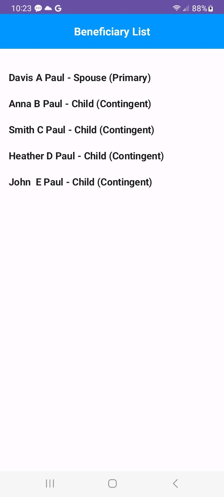
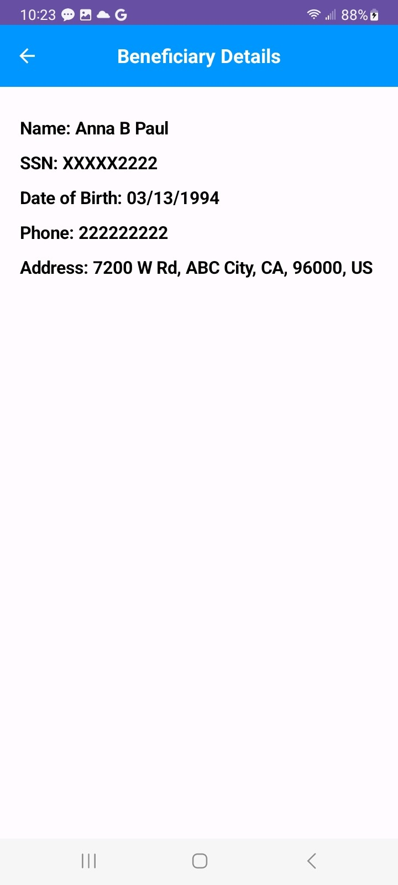
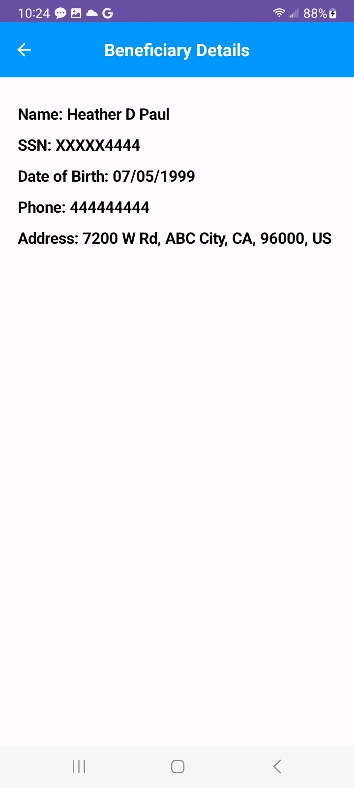
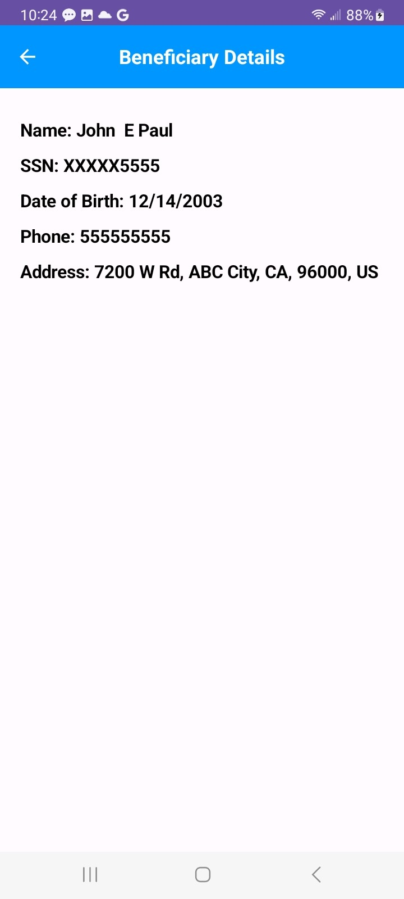

This sample app displays a list of beneficiaries using a RecyclerView in the screen defined by `MainActivity`, fetching and displaying data from a JSON file stored in the assets folder. Upon
clicking a specific person's name, the user is directed to a second screen, where detailed information about the person is displayed by `BeneficiaryDetailActivity`.
The app follows the Model-View-ViewModel (MVVM) architecture, structured as follows:

**Model**: Represents the data layer and includes Kotlin classes like `Beneficiary` and `Address`. These classes are used to parse JSON data and manage the application state.

**View**: Defines the user interface. Activity classes, such as `MainActivity` and `BeneficiaryDetailActivity` display data and provide views for user interaction.

**ViewModel**: Manages UI-related data in a lifecycle-aware manner. `BeneficiaryViewModel` uses LiveData to provide and observe data updates, ensuring that the UI is automatically refreshed 
when the data changes. It also responds to user interactions and updates the data accordingly.

The app’s UI for both screens can be customized in terms of themes, fonts, views, etc. While the JSON file is used for local data in this example, the app can be modified to fetch data from a 
remote server. This data can then be parsed and managed by the ViewModel. On integration with LiveData, the parsed data would update the LiveData object, allowing the UI components to react to 
changes automatically.

Automation can be incorporated for both functional and unit testing to ensure the app’s reliability and correctness. Espresso can be used for UI testing while Mockito and Robolectric for unit 
testing. Detekt can be used for static code analysis and can also be integrated into Continuous Integration/Continuous Deployment (CI/CD) pipelines to check for code issues whenever new code is 
pushed.

## Screenshots

### MainActivity

### BeneficiaryDetailActivity

